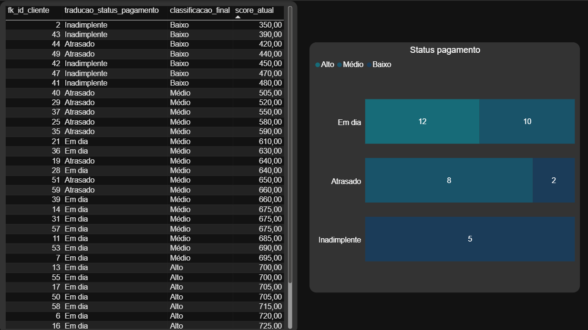

# 📊 Análise de Crédito com ETL e Dashboard

Projeto completo de dados que simula um cenário real de análise de crédito, com foco em **entender o comportamento de clientes, avaliar risco e apoiar decisões de concessão de crédito**. 

O projeto combina **ETL em Python + análise exploratória + dashboard no Power BI**.

---

## 🎯 Objetivo de Negócio

Este projeto tem como objetivo analisar a saúde da carteira de crédito e o comportamento dos clientes, apoiando decisões de concessão, monitoramento de risco e prevenção à fraude.

Principais perguntas de negócio:

- Como o score de crédito varia entre diferentes perfis de clientes?
- Existe relação entre score e risco de inadimplência?
- Quais perfis apresentam maior risco financeiro?
- Há padrões que possam indicar fraude?
- Como o comportamento de crédito evolui ao longo do tempo?

**Observações:**
- Não há dados de salário
- Não há dados de gênero

---

## 🎥 Demonstração do Projeto

📌 Vídeo explicando o dashboard e os principais insights:

👉 [🎥 Ver demonstração do projeto](https://drive.google.com/file/d/1GiyXZlPpwXY_cevUOHvNSKqrtQ0V0RFX/view)

---

## 📊 Indicadores e Métricas

As análises foram construídas com base em:

- Score de crédito (mínimo, máximo e média)
- Distribuição por faixa de score
- Status de pagamento (em dia, atrasado, inadimplente)
- Volume de análises de crédito
- Indicadores de possível fraude

---

## 💡 Hipóteses de Análise

- O volume de análises de crédito varia ao longo do tempo?
- Existe evolução ou degradação no score dos clientes ao longo do período analisado?

---

## 📜 Regras de Negócio

- Um cliente pode possuir múltiplas análises de crédito
- Apenas clientes maiores de 18 anos são considerados
- Não são permitidos CPFs duplicados
- Score de crédito varia de 0 a 1000

---

## 🧱 Arquitetura / Fluxo do Projeto

Fluxo de dados:

```
Dados brutos → ETL (Python/Pandas) → Dados tratados → Power BI → Insights de negócio
```

Esse fluxo garante consistência, qualidade e confiabilidade para análise.

---

## 🔄 ETL (Extração, Transformação e Carga)

O processo de ETL foi implementado em Python com Pandas.

### 👤 Tabela Cliente

* Limpeza e padronização de nomes
* Tratamento de CPF
* Conversão de datas
* Remoção de nulos e duplicados
* Cálculo de idade
* Filtragem de clientes maiores de idade

### 💳 Tabela Análise de Crédito

* Padronização de textos
* Conversão de variáveis categóricas em numéricas
* Tratamento e validação de datas
* Remoção de inconsistências e duplicados
* Garantia de integridade entre tabelas

---

## 📊 Dashboard (Power BI)

Arquivo: `dashboard/dashboard_score_de_credito.pbix`

---

### 👥 Perfil do Cliente


---

### 📈 Visão de Score (Saúde Financeira)


---

### 🔍 Visão de Score (Padrões de comportamento)



---

### ⏱️ Visão Temporal e Fraude


---

### 🔍 Evolução Individual (Drill-down)


---

## 🔍 Principais Insights

* A carteira apresenta predominância de clientes com comportamento saudável de crédito
* O score de crédito está relacionado ao comportamento de pagamento
* Existem variações individuais relevantes que exigem monitoramento contínuo
* A análise temporal ajuda a identificar padrões e possíveis anomalias
* A análise individual permite investigar casos fora do padrão da carteira

---

## 🛠️ Tecnologias utilizadas

* Python
* Pandas
* Power BI

---

## ⚙️ Como executar

```bash
git clone https://github.com/Fernanda-Noll/etl-dashboard-score-credito
cd etl-dashboard-score-credito

python ETL.py
```

---

## 📁 Estrutura do Projeto

```
📦 etl-dashboard-score-credito
 ┣ 📂 dados
 ┃ ┣ 📂 brutos
 ┃ ┗ 📂 tratados
 ┣ 📂 dashboard
 ┣ 📂 imagens
 ┣ 📜 ETL.py
 ┣ 📄 Dicionário de dados das tabelas.pdf
 ┗ 📜 README.md
```

---

## 🎯 Conclusão

Este projeto demonstra um pipeline completo de dados aplicado a um cenário real de risco de crédito.

Ele evidencia competências em:

* Engenharia de dados (ETL)
* Tratamento e qualidade de dados
* Análise exploratória
* Visualização e storytelling com dados

O principal valor do projeto está na transformação de dados brutos em **insights que apoiam decisões estratégicas de crédito**.

---
