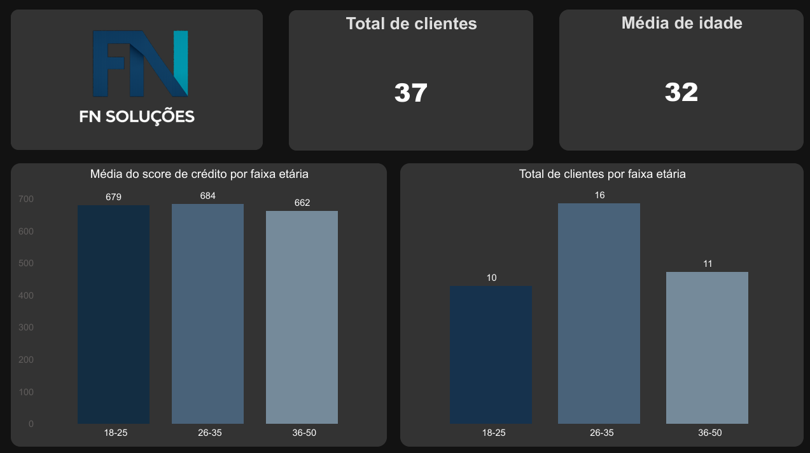
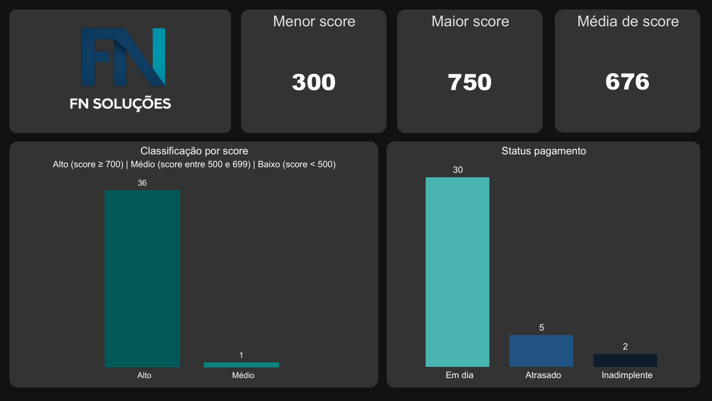
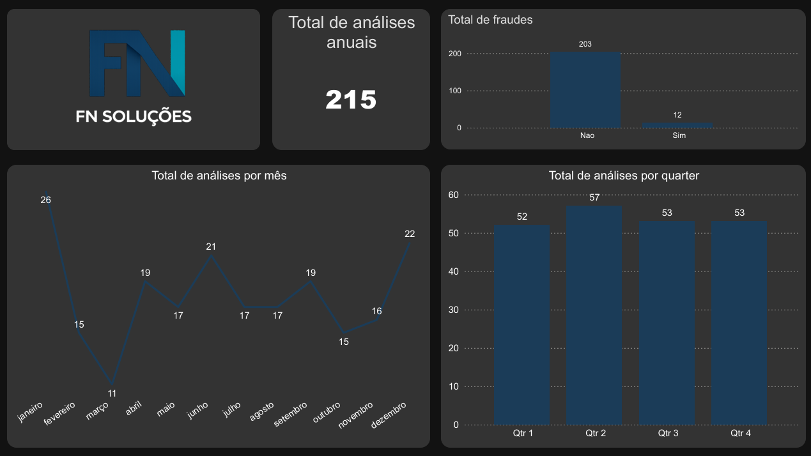
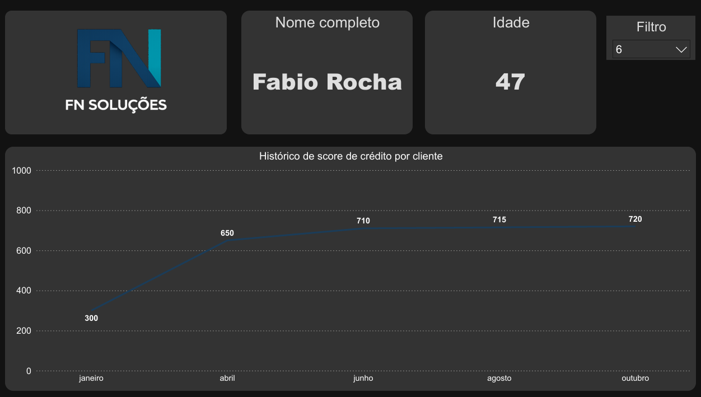

# 📊 Análise de Crédito com ETL e Dashboard

---

## 🎯 Objetivo da Análise

Avaliar a saúde da carteira de crédito e o comportamento dos clientes para apoiar decisões de concessão, monitoramento de risco e prevenção à fraude.

- Entender como o score de crédito varia entre diferentes faixas etárias
- Avaliar o comportamento de pagamento da base (em dia, atrasado, inadimplente)
- Verificar se scores mais altos estão associados a menor risco de inadimplência
- Identificar clientes com alto score e alto valor de crédito
- Monitorar a ocorrência de possíveis fraudes nas análises de crédito

**Observações:**

* Não há dados de salário
* Não há dados de gênero

---

## 📏 Métricas

* Score de crédito (mínimo, máximo e média)
* Distribuição por faixa de score
* Status de pagamento
* Volume de análises
* Detecção de fraude

---

## 📅 Recorte

* Dados referentes ao ano de **2025**

---

## 💡 Hipóteses

* O número de análises de crédito varia ao longo dos meses?
* Os clientes estão melhorando ou piorando seus scores ao longo do tempo?

---

## 📜 Regras de Negócio

* Um cliente pode ter mais de uma análise de crédito
* Apenas clientes maiores de 18 anos são considerados
* Não são permitidos CPFs duplicados
* Score de crédito varia de 0 a 1000

---

## 🗂️ Dados

### Tabela: analise_credito

* id_analise_de_credito
* fk_id_cliente
* data_consulta
* score_credito
* status_pagamento
* valor_credito
* flag_fraude
* data_atualizacao

### Tabela: cliente

* id_cliente
* nome
* sobrenome
* data_de_nascimento
* cpf

---

## 🔄 ETL (Extração, Transformação e Carga)

### 📥 Tabelas Originais

* analise_credito.csv
* cliente.csv

### 🔧 Transformações

#### Função: transformacao_tabela_cliente

* Remoção de valores nulos
* Remoção de CPFs duplicados
* Padronização de datas
* Cálculo de idade
* Filtro de maiores de 18 anos

#### Função: transformacao_tabela_analise_credito

* Remoção de valores nulos
* Remoção de duplicados
* Padronização de datas
* Validação de consistência temporal
* Garantia de integridade entre tabelas

### 💾 Tabelas Tratadas

* dados_cliente_tratados.csv
* dados_analise_credito_tratados.csv

---

## 📊 Dashboard (Power BI)

Arquivo: `dashboard/dashboard_score_de_credito.pbix`

---

### 1. 👥 Perfil do Cliente



---

### 2. 📈 Visão de Score (Saúde Financeira)



---

### 3. ⏱️ Visão Temporal e Fraude




---

### 4. 🔍 Evolução Individual (Drill-down)



---

## 🛠️ Tecnologias utilizadas

* Python
* Pandas
* Power BI

---

## ⚙️ Como executar

1. Clone o repositório.
2. Certifique-se de ter o Python e o Pandas instalados.
3. Execute o script de tratamento de dados:
   ```bash
   python ETL.py

## 📁 Estrutura do Projeto

```
📦 projeto
 ┣ 📂 dados
 ┣ 📂 dashboard
 ┣ 📂 imagens
 ┣ ETL.py
 ┗ 📜 README.md
```

---

## 🎯 Conclusão

### 📊 Resultados principais

- Total de **37 clientes**, com maior concentração na faixa de **26 a 35 anos**
- Score de crédito:
  - Mínimo: **300**
  - Máximo: **750**
  - Média: **676**
- Status de pagamento:
  - **30 em dia**
  - **5 atrasados**
  - **2 inadimplentes**
- Total de análises: **215**
- Fraudes:
  - **12 identificadas**

### 💡 Respostas às hipóteses

- O volume de análises se mantém estável ao longo do tempo, sem grandes variações sazonais
- O desempenho de score varia entre os clientes, com casos de evolução positiva e oscilações ao longo do tempo


### 🎯 Conclusão final

- A carteira apresenta **baixo risco agregado**, com predominância de clientes adimplentes e scores elevados.  
- Observa-se que a variabilidade individual dos scores reforça a necessidade de **monitoramento contínuo** para decisões mais assertivas.